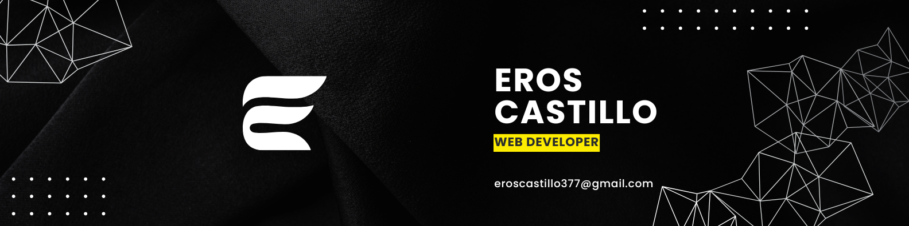

<h1>Hola!, Mi nombre es</h1>

   

<h2>Sobre mi</h2>

<h3> - 📧 Puedes enviarme un correo electronico a <a href="#">eroscastillo377@gmail.com</a> ¡Intentare responder lo mas rapido que pueda!</h3>

<h3> - 📄 Eche un vistaso a mi <a href="#">Curriculum</a> para obtener mas detalles sobre mi.</h3>

<h2>🛠 Lenguajes de programacion</h2>

<h2>💻 Software</h2>

<h2>📞 Comunicacion</h2>

<h2>👷‍♂️ Experencia Laboral</h2>

<h4> - 4 años de servicio al cliente</h4>

<h2>👨‍💻 Proyectos</h2>
